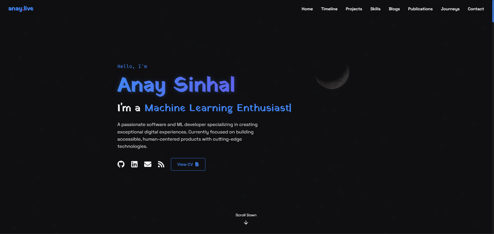

# 🌌 Cosmic Portfolio

**A stunning, interactive personal portfolio website built with React, Three.js, and modern web technologies, showcasing software engineering and machine learning expertise through an immersive cosmic-themed experience.**

## 🌐 Live Demo & Preview

[](https://anaysinhal.vercel.app/)

### 🔗 **Live Website**: [anay.codes](https://www.anay.codes/)

---

## ✨ About

Cosmic Portfolio is a cutting-edge, responsive single-page application that presents a comprehensive showcase of skills, projects, and professional experience in software development and machine learning. The portfolio delivers an exceptional user experience through interactive 3D elements, real-time API integrations, smooth animations, and a meticulously crafted cosmic design aesthetic.

## 🚀 Features

### **Core Experience**

* **🎨 Interactive 3D Cosmic Background**: Immersive animated background powered by Three.js and `@react-three/fiber` with dynamic stars, cosmic particles, and ethereal effects
* **⚡ High-Performance Loading**: Elegant cosmic loader with smooth transitions
* **📱 Fully Responsive Design**: Seamless experience across all devices and screen sizes
* **🎭 Advanced Animations**: Smooth, purposeful animations using Framer Motion with scroll-triggered effects

### **Content Sections**

* **🌟 Hero Section**: Captivating introduction with typed text animations and social links
* **🛠️ Skills Showcase**: Interactive tech stack grid with hover effects and official resource links
* **💼 Professional Timeline**: Interactive education and experience timeline with organization logos
* **📂 Featured Projects**: Curated project gallery with live demos, source code links, and detailed descriptions
* **📝 Blog Integration**: Automatic blog post synchronization from Hashnode with rich content display
* **📚 Publications**: Academic publications and research papers display
* **🏆 Certifications**: Professional certifications and achievements (currently disabled)
* **🗺️ Cosmic Journeys**: Interactive world map showing travel experiences with dynamic zoom and region switching
* **📬 Contact Form**: Integrated EmailJS-powered contact system with form validation
* **📄 CV Viewer**: Dedicated page for viewing the full CV as a PDF
* **📱 Social Integration**: Seamless links to GitHub, LinkedIn, blog, and CV

### **Advanced Technical Features**

* **🎨 Sophisticated Theme System**: Cosmic color palette with gradients, shadows, and consistent design tokens
* **🔄 State Management**: Efficient React hooks and context for optimal performance
* **📊 Data Visualization**: Interactive maps using react-simple-maps with custom markers
* **🎪 Micro-interactions**: Delightful hover states, transitions, and user feedback
* **♿ Accessibility**: ARIA labels, semantic markup, and keyboard navigation support

## 🛠️ Tech Stack

Built with a carefully selected modern technology stack for optimal performance and developer experience:

### **Frontend Core**

* **⚛️ React 18** - Latest React with concurrent features and improved performance
* **💅 Styled Components 5.3** - CSS-in-JS with theme system and dynamic styling
* **🎬 Framer Motion 11** - Advanced animations, transitions, and scroll-triggered effects
* **🧭 React Router DOM 6** - Modern routing with improved API

### **3D Graphics & Visualization**

* **🎯 Three.js 0.160** - 3D graphics library for cosmic background effects
* **🎨 @react-three/fiber 8.15** - React renderer for Three.js with hooks
* **✨ @react-three/drei 9.92** - Useful Three.js components and helpers
* **🌟 @react-three/postprocessing 2.15** - Post-processing effects like bloom

### **Data & API Integration**

* **📡 Axios 1.8** - HTTP client for API requests with interceptors
* **🗺️ React Simple Maps 3.0** - SVG-based interactive map components
* **📊 D3 (d3-fetch, d3-scale) 4.0** - Data manipulation and scaling utilities
* **🗺️ Supercluster 8.0** - Fast geospatial point clustering for map optimization

### **Communication & UX**

* **📧 EmailJS 4.3** - Direct email sending from frontend contact forms
* **🎞️ Lottie React 2.4** - High-quality animations and micro-interactions
* **🎨 React Icons 5.5** - Comprehensive icon library with consistent styling

### **Development & Testing**

* **⚡ React Scripts 5.0** - Zero-config build tooling with optimizations
* **🧪 Testing Library** - Modern testing utilities for React components
  * `@testing-library/react 16.2`
  * `@testing-library/jest-dom 6.6`
  * `@testing-library/user-event 14.5`
* **📏 TypeScript Definitions** - Type safety for Three.js (`@types/three`)
* **📊 Web Vitals 3.5** - Performance monitoring and optimization

## 📁 Project Structure

The project follows a clean, modular architecture optimized for maintainability and scalability:

```plaintext
cosmic-portfolio/
├── 📁 public/                     # Static assets and PWA configuration
│   ├── 📄 index.html              # Main HTML template with meta tags
│   ├── 📱 manifest.json           # PWA manifest for mobile installation
│   ├── 🌙 moon.png               # Favicon and logo asset
│   ├── 🤖 robots.txt             # SEO and crawler directives
│   ├── 📁 projects/              # Project showcase images
│   │   ├── 🖼️ custom-3.png
│   │   ├── 🖼️ custom-4.png
│   │   ├── 🖼️ custom-5.png
│   │   └── 🖼️ custom-6.png
│   ├── 📄 CV_Sinhal_Anay.pdf     # CV PDF for the CV Viewer
│   ├── 📄 main.tex               # LaTeX source for CV generation
│   └── 📁 textures/              # 3D background textures
│       └── 🌙 2k_moon.jpg        # High-resolution moon texture
├── 📁 src/
│   ├── ⚛️ App.js                 # Root component with routing and layout
│   ├── 🎨 App.css                # Global application styles
│   ├── 🧪 App.test.js            # Comprehensive application tests
│   ├── 📄 index.js               # React DOM entry point and configuration
│   ├── 🎨 index.css              # Base CSS reset and global styles
│   ├── 📦 setupTests.js          # Testing environment configuration
│   ├── 📊 reportWebVitals.js     # Performance monitoring setup
│   │
│   ├── 📁 components/            # Reusable UI components
│   │   ├── 🌌 CosmicBackground.js # Three.js powered 3D background
│   │   ├── ⏳ CosmicLoader.js     # Animated loading component
│   │   ├── 🧭 Navigation.js      # Responsive navigation bar
│   │   ├── 👥 SocialLinks.js     # Social media link components
│   │   ├── ⌨️ TypedText.js       # Typing animation component
│   │   ├── 🦶 Footer.js          # Site footer with credits
│   │   └── 📄 CVViewer.js        # PDF CV viewer component
│   │
│   ├── ⚙️ config/               # Configuration and data management
│   │   ├── 👤 personalInfo.js    # All personal content and data
│   │   └── 🎨 theme.js           # Design system and theme tokens
│   │
│   ├── 🎣 hooks/                # Custom React hooks for API integration
│   │   ├── 📦 useGitHubProjects.js  # GitHub REST API integration (unused)
│   │   └── 📝 useHashnodeBlogs.js   # Hashnode GraphQL API integration
│   │
│   ├── 📑 sections/             # Major page sections and features
│   │   ├── 🦸 Hero.js            # Landing section with introduction
│   │   ├── 🛠️ Skills.js          # Interactive tech stack showcase
│   │   ├── � Timeline.js        # Education and experience timeline
│   │   ├── 📂 Projects.js        # Featured projects gallery
│   │   ├── 📝 Blogs.js           # Blog posts integration
│   │   ├── 📚 Publications.js    # Academic publications display
│   │   ├── 🏆 Certifications.js  # Professional certifications (disabled)
│   │   ├── 🗺️ CosmicJourneys.js  # Interactive travel map
│   │   ├── 📬 Contact.js         # Contact form with EmailJS
│   │   ├── 🗺️ in.json           # India map TopoJSON data
│   │   └── 🌍 topo.json         # World map TopoJSON data
│   │
│   └── 🎨 styles/               # Global styling and design system
│       └── 🌐 GlobalStyles.js    # Styled-components global styles
│
├── 📦 package.json              # Dependencies and build scripts
```

### **Architecture Highlights**

* **🔧 Modular Design**: Each section is a self-contained component with its own logic and styling
* **📱 Responsive First**: Mobile-first approach with progressive enhancement
* **🎨 Theme System**: Centralized design tokens for consistent styling
* **🔌 API Integration**: Custom hooks for external data fetching with error handling
* **⚡ Performance**: Optimized animations, lazy loading, and efficient re-renders
* **♿ Accessibility**: Semantic HTML, ARIA labels, and keyboard navigation support

## 🚀 Getting Started

### **Prerequisites**

Before you begin, ensure you have these tools installed:

* **Node.js** (v24.x) - [Download here](https://nodejs.org/)
* **npm** (comes with Node.js) or **yarn** - Package manager
* **Git** - Version control system

### **Quick Start**

1. **Clone the repository:**

   ```bash
   git clone https://github.com/anayy09/cosmic-portfolio.git
   cd cosmic-portfolio
   ```

2. **Install dependencies:**

   ```bash
   npm install
   # or
   yarn install
   ```

3. **Set up environment variables (optional):**

   Create a `.env` file in the root directory for EmailJS integration:

   ```env
   REACT_APP_EMAILJS_SERVICE_ID=your_service_id
   REACT_APP_EMAILJS_TEMPLATE_ID=your_template_id
   REACT_APP_EMAILJS_PUBLIC_KEY=your_public_key
   ```

4. **Start the development server:**

   ```bash
   npm start
   ```

   Open [http://localhost:3000](http://localhost:3000) to view the portfolio in your browser.

### **Available Scripts**

| Command | Description |
|---------|-------------|
| `npm start` | 🚀 Runs the app in development mode with hot reload |
| `npm test` | 🧪 Launches the test runner in interactive watch mode |
| `npm run build` | 📦 Creates an optimized production build |
| `npm run eject` | ⚠️ Ejects from Create React App (irreversible) |

### **Build for Production**

```bash
npm run build
```

This creates a `build/` folder with optimized files ready for deployment to any static hosting service like:

* **Vercel** - Zero-config deployment with automatic HTTPS
* **Netlify** - Continuous deployment with form handling
* **GitHub Pages** - Free hosting for public repositories
* **AWS S3** - Scalable cloud hosting with CloudFront CDN

## 🚀 Deployment Guide

### **Deploy to Vercel (Recommended)**

[](https://vercel.com/new/clone?repository-url=https://github.com/anayy09/cosmic-portfolio)

1. **Fork this repository** to your GitHub account
2. **Connect to Vercel**: Visit [vercel.com](https://vercel.com) and sign in with GitHub
3. **Import your fork**: Click "New Project" and select your forked repository
4. **Configure environment variables** (if using EmailJS):

   ```env
   REACT_APP_EMAILJS_SERVICE_ID=your_service_id
   REACT_APP_EMAILJS_TEMPLATE_ID=your_template_id
   REACT_APP_EMAILJS_PUBLIC_KEY=your_public_key
   ```

5. **Deploy**: Click deploy and your site will be live in minutes!

### **Deploy to Netlify**

[](https://app.netlify.com/start/deploy?repository=https://github.com/anayy09/cosmic-portfolio)

1. **Fork this repository**
2. **Connect to Netlify**: Sign in to [netlify.com](https://netlify.com)
3. **New site from Git**: Select your forked repository
4. **Build settings**:
   * Build command: `npm run build`
   * Publish directory: `build`
5. **Add environment variables** in Site Settings > Environment variables
6. **Deploy**: Your site will be live with a custom `.netlify.app` domain

### **Deploy to GitHub Pages**

1. **Install gh-pages**:

   ```bash
   npm install --save-dev gh-pages
   ```

2. **Add to package.json**:

   ```json
   {
     "homepage": "https://yourusername.github.io/cosmic-portfolio",
     "scripts": {
       "predeploy": "npm run build",
       "deploy": "gh-pages -d build"
     }
   }
   ```

3. **Deploy**:

   ```bash
   npm run deploy
   ```

### **Custom Domain Setup**

After deployment, you can add a custom domain:

* **Vercel**: Project Settings > Domains
* **Netlify**: Site Settings > Domain management
* **GitHub Pages**: Repository Settings > Pages > Custom domain

## 🎨 Customization

Make the portfolio your own by customizing the content and styling:

### **Personal Information**

Edit `src/config/personalInfo.js` to update:

* **👤 Basic Information**: Name, professional title, contact details
* **🔗 Social Links**: GitHub, LinkedIn, blog, CV links
* **🎯 Skills & Technologies**: Tech stack with official resource links
* **💼 Experience**: Work experience with logos, dates, and descriptions
* **🎓 Education**: Academic background and achievements
* **📝 Projects**: Custom project showcase with images and links
* **🏆 Certifications**: Professional certifications and credentials (currently commented out)
* **📚 Publications**: Academic papers and research publications
* **🗺️ Travel Journeys**: Places visited with coordinates and stories
* **⚙️ API Configuration**: GitHub and Hashnode usernames, EmailJS settings

### **Theme Customization**

Modify `src/config/theme.js` to change:

* **🎨 Color Palette**: Primary, secondary, accent colors
* **🌌 Gradients**: Cosmic gradients for backgrounds and text effects
* **🔤 Typography**: Font families for headings, body text, and code
* **📱 Breakpoints**: Responsive design breakpoints for different devices
* **⏱️ Animations**: Transition timings and easing functions
* **🌟 Effects**: Shadows, glows, and visual effects

### **Styling & Layout**

Update global styles in `src/styles/GlobalStyles.js`:

* **🌐 CSS Reset**: Base styles and normalization
* **📐 Layout**: Grid systems and spacing utilities
* **🎭 Animations**: Global animation keyframes
* **📱 Responsive**: Mobile-first styling approach

### **Content Sections**

Each section can be customized independently:

* **`Hero.js`**: Landing page introduction and social links
* **`Skills.js`**: Technology showcase with icons and descriptions
* **`Timeline.js`**: Professional and educational timeline
* **`Projects.js`**: Featured projects gallery (uses custom projects from personalInfo)
* **`Blogs.js`**: Blog integration settings
* **`Publications.js`**: Academic publications display
* **`Certifications.js`**: Professional certifications (currently disabled)
* **`CosmicJourneys.js`**: Travel map configuration
* **`Contact.js`**: Contact form styling and validation
* **`CVViewer.js`**: CV PDF viewer (displays /CV_Sinhal_Anay.pdf)

### **Environment Configuration**

Create `.env` files for different environments:

```env
# .env.local (for development)
REACT_APP_EMAILJS_SERVICE_ID=your_dev_service_id
REACT_APP_EMAILJS_TEMPLATE_ID=your_dev_template_id
REACT_APP_EMAILJS_PUBLIC_KEY=your_dev_public_key

# Optional: GitHub API token for higher rate limits (currently unused)
REACT_APP_GITHUB_TOKEN=your_github_token
```

## 🚀 Deployment

### **Environment Variables for Production**

Set these variables in your hosting platform:

* `REACT_APP_EMAILJS_SERVICE_ID`
* `REACT_APP_EMAILJS_TEMPLATE_ID`  
* `REACT_APP_EMAILJS_PUBLIC_KEY`

### **Deployment Platforms**

#### **Vercel (Recommended)**

```bash
npm install -g vercel
vercel --prod
```

#### **Netlify**

```bash
npm run build
# Upload build/ folder to Netlify
```

#### **GitHub Pages**

```bash
npm install --save-dev gh-pages
npm run build
npx gh-pages -d build
```

## 🤝 Contributing

We welcome contributions! Here's how to get started:

1. **🍴 Fork the repository**
2. **🌿 Create a feature branch**: `git checkout -b feature/amazing-feature`
3. **💻 Make your changes** with proper testing
4. **✅ Commit changes**: `git commit -m 'Add amazing feature'`
5. **📤 Push to branch**: `git push origin feature/amazing-feature`
6. **🔄 Open a Pull Request** with detailed description

### **Development Guidelines**

* **📝 Code Style**: Follow existing patterns and use Prettier
* **🧪 Testing**: Add tests for new features
* **📱 Responsive**: Ensure mobile compatibility
* **♿ Accessibility**: Follow WCAG guidelines
* **⚡ Performance**: Optimize for loading speed

## 📄 License

This project is open source and available under the [MIT License](LICENSE).

## 📞 Contact

**Anay Sinhal**

* **📧 Email**: [sinhal.anay@ufl.edu](mailto:sinhal.anay@ufl.edu)
* **💼 LinkedIn**: [linkedin.com/in/anaysinhal](https://linkedin.com/in/anaysinhal)
* **📄 CV**: [View CV](https://anaysinhal.vercel.app/cv)
---

⭐ **Star this repository if you found it helpful!** ⭐